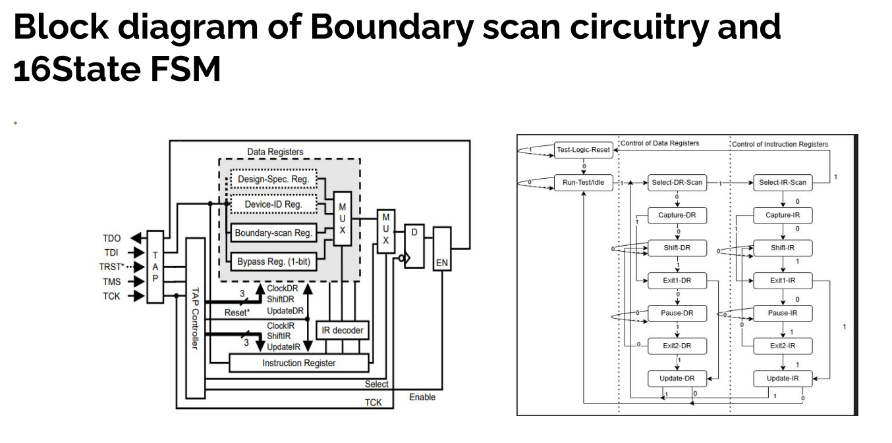

# TAP-Controller-IEEE-1149.1-JTAG-
TAP Controller – IEEE 1149.1 (JTAG) SystemVerilog, Simulation Testbenches, Functional Equivalence
• Implemented JTAG test-access-port logic in SystemVerilog and built simulation testbenches to verify scan-chain data
integrity against the specification.
• Confirmed functional equivalence between the design and its specification through directed simulation directly
relevant to checking consistency between a verification model and RTL design.

## TAP Controller / JTAG Overview

### Introduction to JTAG
- JTAG (Joint Test Action Group) is an **IEEE 1149.1** standard for testing and debugging digital circuits.
- Provides a serial interface for accessing hardware components.
- Used for boundary scan testing, debugging, and programming.

### What is a TAP Controller?
- The **TAP (Test Access Port) Controller** is the core of JTAG architecture.
- Manages data flow between the processor and debugging tools.
- Controls the execution of test operations using a state machine.

### Block Diagram: Boundary Scan Circuitry & 16-State FSM

The diagram above shows two views of the TAP architecture:
- **Left:** the boundary-scan circuitry — TAP pins (TDI, TDO, TMS, TCK, TRST*), the TAP Controller, Instruction Register, IR decoder, and the data register bank (Bypass, Boundary-scan, Device-ID, Design-Spec registers) muxed out to the output.
- **Right:** the 16-state TAP Controller FSM, covering the `Test-Logic-Reset` and `Run-Test/Idle` states, and the parallel DR-scan / IR-scan paths (`Select`, `Capture`, `Shift`, `Exit1`, `Pause`, `Exit2`, `Update`) that control data and instruction register access.

### Applications of the JTAG TAP Controller
- **Processor Debugging** — step-through execution, breakpoints, and register/memory inspection via the JTAG interface.
- **FPGA & SoC Configuration** — loading bitstreams and configuration data through the boundary-scan chain.
- **Fault Diagnosis** — boundary-scan testing to detect manufacturing defects and interconnect faults on the PCB without physical probing.
